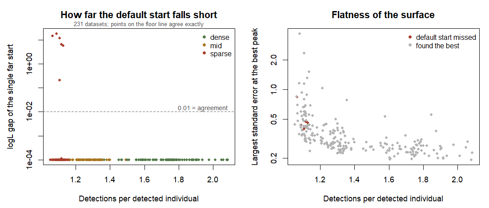

# 単一の初期値からの最尤推定はいつ信頼できないか

**231データセット / 62.3時間 / 失敗0件**（`examples/multistart_study.R`、2026-09-21〜24）。

---

## 0. 結論

1. **多峰性は実在する。ただし疎な領域に限られる。**
   1個体あたり検出 1.73 と 1.29 では **231件中0件**、1.11 では **77件中6件（7.8%）**
2. **外すときは大きく外す。** 遅れの中央値は**対数尤度 9.1**、最大 18.1。
   境界線上の話ではない
3. **峰が複数あること自体は珍しくない**（疎で24.7%）。
   **それでも既定の初期値が最良を見つける確率は 92%。存在と失敗は別**
4. **足環データは危険域にある。** 見込み 1.09 検出/個体で、失敗が出た領域（≤1.13）の中
5. **原著と矛盾しない。** 原著のシミュレーションは 10.9 検出/個体（疎シナリオでも1.66）。
   **"For all iterations, estimations of ADCR converged successfully" は、その密度では正しい**

---

## 1. 設計

再捕獲の密度を3水準に振り、各データセットで **BFGS を5点から**回した。

**1点目は必ず既定の遠方初期値**（`INIT_FAR`）。**これが利用者が実際にやること**だから。
残り4点はその周りに散らした点。**「既定の1本が、5点のうち最良に並んだか」**を数えた。

10件に1回、**同じ遠方の初期値から Adam も1本**（`beta2=0.9` / `alpha`×1 / 400反復）。

| 水準 | n | 検出個体 | 複数回 | 単回 | **検出/個体** | 最大SE中央値 |
|---|---|---|---|---|---|---|
| `dense` | 77 | 92.1 | 34.9 | 57.2 | **1.73** | 0.249 |
| `mid` | 77 | 155.2 | 31.4 | 123.8 | **1.29** | 0.288 |
| `sparse` | 77 | 227.5 | 22.3 | 205.1 | **1.11** | 0.432 |

---

## 2. 結果

### 2.1 失敗は疎な領域にだけ現れる

| 水準 | 検出/個体 | **既定初期値が最良を逃した** | 峰が2つ以上 | 遅れの最大 |
|---|---|---|---|---|
| `dense` | 1.73 | **0 / 77（0%）** | 0% | 6.4e−06 |
| `mid` | 1.29 | **0 / 77（0%）** | 5.2% | 5.8e−05 |
| **`sparse`** | **1.11** | **6 / 77（7.8%）** | **24.7%** | **18.1** |

全体では 6/231（2.6%）。

**左の図に中間が無いのが要点。** 遅れは「1e−4（完全一致）」か「0.2〜18」かのどちらかで、
**収束の精度の問題ではなく、別の峰に落ちたか否かという離散的な事象。**

### 2.2 外すときの大きさ

| | |
|---|---|
| 遅れ（対数尤度）の中央値 | **9.10** |
| 範囲 | 0.21 〜 18.10 |

失敗した6件の内訳:

| idx | 検出個体 | 複数回 | 検出/個体 | 峰 | **遅れ** | 最大SE |
|---|---|---|---|---|---|---|
| 87 | 232 | 21 | 1.108 | 2 | 0.211 | 計算不能 |
| 93 | 215 | 22 | 1.116 | 2 | **6.575** | 0.471 |
| 105 | 215 | 16 | 1.088 | 2 | **18.103** | 0.434 |
| 168 | 230 | 13 | 1.065 | 3 | **14.332** | 0.842 |
| 189 | 225 | 14 | 1.107 | 2 | **11.627** | 0.398 |
| 210 | 219 | 22 | 1.128 | 2 | **5.736** | 0.460 |

**複数回捕獲の個体数が効いている。** 失敗6件の複数回は 13〜22 で、
`sparse` 全体の平均 22.3 より少ない側に寄っている。**連結性の情報を運ぶのは複数回個体**なので、
それが減ると面が平たくなり、峰が分かれる。

### 2.3 平坦さが予測する

| | 最大SE の中央値 |
|---|---|
| 逃した件 | **0.460** |
| 逃さなかった件 | 0.293 |

面が平たいほど失敗しやすい。**ただし SE は当てはめた後にしか分からない**ので、
事前の選別には使えない。**事後の警告としては使える**（SE が大きければ多点出発を疑う）。

### 2.4 Adam は23件すべてで最良に並んだ

| | |
|---|---|
| 実施 | 23件（10件に1回）。うち疎が7件 |
| BFGS 最良との差 | 中央値 **0.0002**、最大 0.0009 |
| 0.01 以内 | **23/23（100%）** |
| BFGS を上回った件 | 0 |

**うち1件は直接対決になった。**

`idx 210`（疎、1.128 検出/個体）で、**同じ遠方の初期値から**:

| | logL |
|---|---|
| BFGS（既定の遠方初期値） | −113.566 |
| **Adam（同じ初期値）** | **−107.830** |
| 5点中の最良 | −107.830 |

**BFGS が 5.74 外し、Adam は最良に並んだ。**

> **ただし、これで「Adam のほうが頑健」とは言えない。**
> 疎での Adam は7件しかなく、失敗率 7.8% なら期待される失敗数は 0.5件。
> **0件だったことに統計的な意味は無い。** 方向としては興味深い、という以上は言えない。
> 09-17 に一度「Adam が BFGS に勝った」と書いて取り下げている。同じ轍を踏まない。

### 2.5 コスト

1データセットあたり（BFGS 5点 ＋ ヘッセ行列、`ncell` = 400）:

| 水準 | 中央値 | 90%点 | 最大 |
|---|---|---|---|
| `dense` | 9.5分 | 22.3分 | 57.1分 |
| `mid` | 10.7分 | 28.0分 | 65.7分 |
| `sparse` | 16.7分 | 37.8分 | 84.3分 |

**疎なほど遅い。** 個体数が多い（227 対 92）ことと、収束に要する反復が増えることの両方。

---

## 3. 原著との関係

原著（Fukasawa & Higashide 2025）は **"For all iterations, estimations of ADCR converged
successfully"** と書いている。**この結果はそれと矛盾しない。**

| | 検出/個体 | この研究での失敗率 |
|---|---|---|
| 原著・基準シナリオ | **10.9** | （0% の領域のさらに外） |
| 原著・疎シナリオ | **1.66** | 0%（`dense` 1.73 に近い） |
| クマ実データ | 2.49 | 0% の領域 |
| **この研究の `sparse`** | **1.11** | **7.8%** |
| **足環データ（見込み）** | **1.09** | **危険域** |

**原著が探索した範囲では、単一の初期値で十分だった。**
**足環データはその範囲の外にある**、というのがこの研究の位置づけ。

---

## 4. 実務上の結論

### 足環データの本番解析では多点出発が必須

**7.8% は無視できない。** しかも外したときの代償が対数尤度で9前後なので、
**「たまたま悪い答えが出て、それと気づかない」**という形の失敗になる。

**推奨**: 3点以上から出発し、**最良の対数尤度で並ぶかを確認する**。
一致すれば採用、割れたら最良を採る。**`examples/verify_reference.R` がこの確認を実装している。**

### コストの見積もり

**1反復24分のクマ規模では、多点出発は「条件の数 × 出発点の数」に直に効く。**
足環データではさらに重い。**Step 4 の計画では、出発点の数を最初から予算に入れること。**

ただし **`dense` / `mid` で失敗が0件だった**ことは朗報でもある。
**メッシュ解像度や検出器の設計で 1個体あたり検出数を 1.3 以上に持っていければ、
この問題は消える。** 設計で回避できる問題でもある。

---

## 5. この研究の限界

1. **「最良」は5点中の最良にすぎない。** 6点目がさらに良い峰を見つける可能性は排除していない。
   **失敗率 7.8% は下限**
2. **失敗した6件のデータを保存していない。** 要約だけを CSV に残す設計だったので、
   **いちばん興味深い6件を後から調べられない。**
   → `multistart_study.R` を直し、`far_is_best` が偽の件はデータも保存するようにすべき
3. **Adam の比較は検出力不足**（2.4）
4. **`ncell` = 400 の合成データ。** 実データの `ncell` は 8497、足環は全国規模。
   **規模が変われば地形も変わる**可能性がある
5. **密度の水準は `TRUE_G0` と `TRUE_DENS` で作っている。** 検出/個体だけでなく
   個体数も同時に動いているので、**両者の効果を分離していない**

---

## 付録: 使ったファイル

| | |
|---|---|
| `examples/multistart_study.R` | 本体。1件ごとに CSV へ追記、時間で自己停止、再開可 |
| `examples/multistart_summary.R` | この要約と図を出す |
| `results/multistart_study.csv` | 231件の生の記録（追跡対象） |
| `reports/20260916_bracket_report.md` | 前提となる 09-16〜17 の実験。§8.3b が多峰性の発見 |
| `examples/verify_reference.R` | 参照解が最大点かを確かめる |
