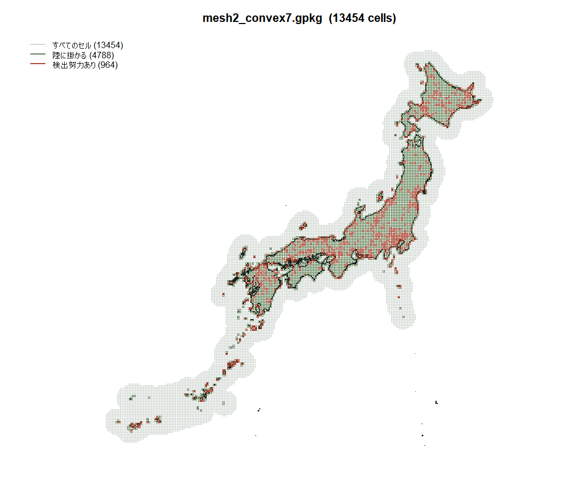

# 足環データの規模チェックと、Step 4 に足りないもの

`examples/band_scale_check.R` / `examples/plot_mesh.R` の実測。
**Step 4（本番解析）の設計はここから決まる。**

---

## 0. 結論

1. **いちばん効く手はメッシュ。** `ncell` = 13,454 のうち **64% が海**。
   **陸に切れば 4,788 になり、1反復 49分 → 3.7分（300反復で10日 → 19時間）**
2. **`pcap` の性能バグの修正は、もう任意ではない。** 最大の種で 354,950 個体
3. **`effort$meshcode` は JIS メッシュコードではなく「行番号」**（§4）。
   **ファイルと並び順に依存する。取り違えると黙って別の場所を指す**
4. **「1個体あたり検出数を上げれば多峰性を回避できる」という以前の助言は誤り**（§5）
5. **ただし「25種が危険域」という判定も、そのままは当てにならない**（§6）
6. **ヤマガラで進めるには、まだ確認・決定すべきことが11件ある**（§8）

---

## 1. 実測された規模

| | |
|---|---|
| 種数 | 30（`splist` は236種。データがあるのは先頭30） |
| 検出努力 | **4,229**（クマは227） |
| 努力が置かれたメッシュ | 964 |
| 年 | 2009〜2018（10年） |
| **`ncell`**（`mesh2_convex7.gpkg`。**解析に使う世代**） | **13,454**（クマは8,497。**1.6倍**） |
| うち陸に掛かるセル | **4,788（35.6%）** |
| 海だけのセル | 8,666（64.4%） |
| CRS / セルの大きさ | JGD2000 / UTM zone 54N、**10km × 10km の正則格子** |
| 個体数の合計 | 1,159,406 |
| 複数回捕獲の合計 | 51,419（**4.4%**） |
| 1個体あたり検出数 | 最小 1.01 / 中央 1.05 / 最大 1.34 |

種ごとの内訳は `results/band_scale_check.csv`。

---

## 2. メッシュ — 6割が海。ただし「凸包」ではなく「緩衝帯」だった



**当初「凸包で海を大量に含む」と書いたが、実測で形が違った。**
`make_mesh_20251127.R:48-55` は確かに凸包を作っているが、
**実際に解析で使われている `convex7` は海岸線を膨らませた形**で、
海のセルは**島の周囲の緩衝帯**になっている（図1）。

| | セル数 |
|---|---|
| 全体 | **13,454** |
| 陸に掛かる | **4,788（35.6%）** |
| 海だけ | 8,666（64.4%） |
| **検出努力のあるセルのうち海だけのもの** | **5 / 964** |

### 陸に切った場合

```
(4788 / 13454)^2.5 = 1/13
```

クマ（8,497セル、1反復15.6分）との比で見ると:

| | `ncell` | クマ比 | 1反復 | 300反復 |
|---|---|---|---|---|
| 現在（`convex7`） | 13,454 | 3.15倍 | **49分** | **10日** |
| **陸に切った場合** | **4,788** | **0.24倍** | **3.7分** | **19時間** |

**陸に切れば、クマの解析より4倍軽くなる。** `advdiff` の項に限った話で、
個体数の項（§3）は別に乗る。

### ただしこれは緩衝帯を削る操作でもある

**SCR/ADCR では、検出器の外に行動圏中心を持つ個体を扱うために
状態空間を検出器より広く取る必要がある**（緩衝帯）。
図1の灰色のリングはそれにあたる。

**クマのメッシュ名 `meshutm_0.5km_buff_land` は「緩衝帯を取り、陸に切った」と読める。**
つまり**正しい手順は「緩衝してから陸に切る」**で、陸上の緩衝帯は残る。
4,788セルには陸側の緩衝帯が含まれているので、この操作で緩衝帯が消えるわけではない。

### 海を落とすと島が分断される

**日本は列島なので、海セルを落とすと北海道・本州・四国・九州・南西諸島が
それぞれ独立した領域になる。** 拡散モデルの上では**島の間を個体が移動できなくなる**。

- **ヤマガラは留鳥**なので、これは生物学的に妥当な近似になりうる
- **一方で、孤立した1セルだけの小島**が残ると、そこに行動圏中心を持つ個体は
  拡散先が無い。**数値的に問題を起こす可能性がある。要確認**
- 渡り鳥を扱う段階では、この近似は使えない

**計算の都合だけで決めてはいけない。種によって答えが変わる。**

---

## 3. 個体数 — `pcap` の修正は任意でなくなった

最大の種で **354,950 個体。クマ（109）の 3,256倍。**

`loglf` のコストは `nind` の約 **1.8乗**（`results/pcap_bench.csv`）。
**本家 `pcap_poisson` の性能バグに由来する**（`ind_cov.minCoeff()` が最内ループにあり
`O(nind²)` になる。`reports/pcap_fix_decision.md`）。修正すれば指数は **1.10**。

| | 指数 | この規模での外挿 |
|---|---|---|
| 現行 | 1.78 | — |
| 修正版 | 1.10 | **約86倍速**（`nind` 19,200 での実測 11.8倍からの外挿） |

**2026-09-14 に「論文化のとき記述が煩雑になる」として見送った判断は、
109個体のクマを前提にしていた。**

**選択肢**: (a) 本家に取り込んでもらう（`examples/pcap_bench.R` が再現コード）、
(b) ローカルで修正して論文に明記、(c) `sampling_rate` で回避。
**(c) だけでは足りない**（間引いても種1で実効46,448個体、クマの426倍）。

---

## 4. ★ `meshcode` の出自 — これは行番号である

**後から必ず誰かが踏む落とし穴なので、経緯を残す。**

### 4.1 何が起きているか

```r
# make_mesh_20251127.R:62-64  — gpkg を書く側
mesh10km_convex_gpkg <- mesh10km_convex %>%
  mutate(meshcode = as.character(grid)) %>%   # jpgrid のメッシュコード
  dplyr::select(meshcode, everything(), -grid)

# make_data&plot.R:99-100  — 読む側で**行番号を振り直す**
mesh <- st_read("../../griddata/mesh2_convex7.gpkg") %>%
  mutate(meshcode2 = row_number())            # ← 1, 2, 3, ...

# :102-103  捕獲地点をメッシュに空間結合
band_place <- st_join(band_place, mesh, join = st_within, left = FALSE)

# :106-109  **行番号だけを取り出して meshcode と改名。元のコードは捨てる**
band_data <- band_place %>% st_drop_geometry() %>%
  dplyr::select(colname, meshcode2) %>%
  rename(meshcode = meshcode2)

# :115
effort <- make.effort2(band_data)             # この meshcode で集計
```

**`effort$meshcode` は `mesh2_convex7.gpkg` の行番号。** 観測された値が
`1857`, `7723`, `4408` と4桁なのはそのため（JIS の2次メッシュコードは6桁）。

`dataset$griddata` 側（`make_data&plot.R:179-182`）では元のコードを
`oldmeshcode2` に退避しているが、**`band_data` 側には残っていない。**

### 4.2 なぜ危ないか

- **行番号は、ファイルと読み込み順序が固定されている間しか意味を持たない**
- **gpkg を作り直す・並べ替えると、全コードが黙って別のセルを指す**
- **世代が複数ある**（`mesh2_convex2` / `convex3` / `convex7` を確認）。
  行数が同じ世代があると、取り違えても気づけない

### 4.3 突合のしかた

**行番号で突合する。`meshcode` 列で照合してはいけない。**

```
Rscript examples/plot_mesh.R                 # 既定で行番号で突合する
Rscript examples/plot_mesh.R --join code     # 本物のメッシュコードを持つ格子の場合
```

`plot_mesh.R` は3段階で検算する:

1. **範囲の照合** — `effort$meshcode` の最小・最大とメッシュの行数。
   **行数を超えていたらファイルが違う**
2. **世代の列挙** — 同じフォルダの `mesh2_convex*.gpkg` の行数を並べる
3. **図** — 赤（検出努力のセル）が**放鳥ステーションのありそうな場所に出ているか**。
   突合を間違えていれば海の真ん中に散る。**これがいちばん確実**

### 4.4 使うべきファイル

**`mesh2_convex7.gpkg`（13,454セル）。** `make_data&plot.R` がこれに行番号を振っている。
`config.R` の `BAND_MESH` をこれに合わせた。

**世代は8つある。行数が同じものが3つあるのが危険:**

| | セル数 |
|---|---|
| `mesh2_convex.gpkg` | 26,170 |
| `mesh2_convex2.gpkg` | 26,459 |
| `mesh2_convex3.gpkg` | 26,459 |
| `mesh2_convex4.gpkg` | 20,142 |
| **`mesh2_convex5.gpkg`** | **13,454** |
| **`mesh2_convex6.gpkg`** | **13,454** |
| **`mesh2_convex7.gpkg`** | **13,454 ← 使うもの** |
| `mesh2_convex_kanto.gpkg` | 1,013 |

**convex5 / 6 / 7 は行数が同じ。** 範囲の照合（§4.3-1）では区別が付かないので、
**取り違えても静かに間違った結果になる。** 図での目視（§4.3-3）が最後の砦。

> **2026-09-28 の失敗として記録**: 最初 `mesh2_convex3.gpkg` を見て
> `meshcode` 列で突合していた。**ファイルも方法も違った。**
> 静かに間違った図が出るところだった。

### 4.5 突合が正しいことの検算（2026-09-28、実測）

**964の検出努力セルのうち、海だけのセルは 5個（0.5%）。**

メッシュ全体では 64.4% が海なので、**行番号の対応が間違っていれば
努力セルの6割前後が海に落ちるはず**。実際は 0.5%。

**放鳥ステーションは陸にあるのだから、これは突合が正しいことの強い証拠になる。**
図1でも赤いセルが北海道から南西諸島まで陸に沿って分布している。

**ファイルと方法を両方間違えていた状態から、この検算で回復できた。**
**今後メッシュの世代を変えるときは、必ずこの数字を見ること。**

### 4.5 将来の改善

**`band_data` 側にも元のメッシュコードを残すほうが安全。**
`make_data&plot.R:108` の `dplyr::select(colname, meshcode2)` に
`meshcode` を足すだけで済む。データの作り直しが要るので、Step 4 の設計と合わせて判断する。

---

## 5. 訂正 — 「設計で回避できる」は誤りだった

2026-09-24 のレポートと、その後の会話で

> メッシュ解像度や検出器の設計で1個体あたり検出を1.3以上にできれば、この問題は消える

と書いた。**これは誤り。**

**1個体あたり検出数 = 総検出数 ÷ 検出個体数**で、**現地で何回再捕獲されたか**という
データの性質。メッシュを変えても分子も分母も変わらない。
**設計で動かせるのは `ncell` であって、この量ではない。**

原著の要旨が最初に書いているとおり —
*"this approach is challenging owing to the sparseness of recapture events"* —
**再捕獲の少なさは鳥類標識データの本質**で、回避する対象ではなかった。

---

## 6. 「25種が危険域」も、そのままは当てにならない

**09-24 の研究の危険域は比だけで定義されていた。絶対量が違いすぎる。**

| | 1個体あたり検出 | **複数回捕獲の個体数** | 最大SEの中央値 |
|---|---|---|---|
| 09-24 の研究・`sparse` | 1.11 | **22** | 0.43 |
| 足環・種1 | 1.05 | **12,170** | ? |

**比は似ていても、連結性の情報を運ぶ個体数が550倍違う。**
多峰性が出たのは**比が低いからではなく、絶対的な情報量が乏しかったから**かもしれない。

**未解決の問いであって、確定した危険ではない。**

### 決着させる実験（数時間）

```
現行の sparse : 複数回 22 / 単回 205  （比 1.11）
追加する条件  : 複数回 500 / 単回 5000（比 1.10、絶対量は20倍以上）
```

**どちらが効いているかが分かれば、足環データに多点出発が要るかが決まる。**

---

## 7. ヤマガラを選ぶ理由

**留鳥で定住性が高い。** ADCR は行動圏が定常状態にあることを前提にした
移流拡散モデルなので、**渡りをする種は前提を壊す**（09-15 の議論）。

30種にはツバメ・キビタキ・ノゴマなど渡り鳥が多数含まれる。
**ヤマガラは季節移動をほとんどしないので、モデルの仮定にいちばん素直。**

再捕獲率も留鳥のほうが高くなる傾向があり、§6 の問題も軽くなる可能性が高い。

---

## 8. ヤマガラで進めるために足りないもの

### A. データとして確認が要る（6件）

| | 内容 |
|---|---|
| **A1** | **ヤマガラが `detect_list` の何番目か。** `splist` の先頭30種の並びと `detect_list` の並びが一致している前提で名前を割り当てている（`band_scale_check.R`）。**その前提自体を確認する** |
| **A2** | **ヤマガラの個体数・複数回捕獲数・1個体あたり検出数。** `results/band_scale_check.csv` にあるが、A1 が確定してから読む |
| ~~**A3**~~ | ~~`mesh2_convex7.gpkg` の行数~~ **確認済み: 13,454セル**（うち陸 4,788）。§2 |
| **A4** | **環境共変量が `convex7` に対して用意されているか。** `make_mesh_20251127.R:72-83` が `landuse2.csv` を meshcode で結合しているが、**どの世代に対してか、どの変数か、標準化済みか**が未確認。**共変量が無ければ連結性は推定できない**（`C ~ 1` だけになる） |
| **A5** | **再捕獲の種類。** ステーションでの再捕獲と一般からの回収報告が混ざっていないか。**混ざっていると検出過程が違う**（回収は人口密度・報告率に依存）。09-15 に「検出器の定義はここで決まる」と書いた論点 |
| **A6** | **齢の情報が使えるか。** 幼鳥＝出生地分散／成鳥＝繁殖地分散は別の過程。混ぜるとどちらでもない値が出る。連結性には個体共変量を入れられないので**層別で対応する**しかない |

### B. モデルの決定が要る（3件）

| | 内容 |
|---|---|
| **B1** | **メッシュを陸に切るか**（§2）。ヤマガラは留鳥なので**切ってよいはず**だが、島嶼部の扱いを決める必要がある |
| **B2** | **検出過程を `pcap_poisson` と `pcap_bin` のどちらにするか。** `effort` は「メッシュ×年」に集約された延べ日数。**同じ個体が同じ年に同じメッシュで複数回捕まった場合の扱い**がここで決まる |
| **B3** | **occasion を年にするか。** 2009〜2018 の10年。年を occasion にすると10機会。**年をまたぐ移動を「行動圏の広がり」と読むか「年変動」と読むか**が変わる |

### C. 計算の見積もりに要る（2件）

| | 内容 |
|---|---|
| ~~**C1**~~ | ~~格子が正則か~~ **解決: 正則だった。** CRS は JGD2000 / UTM zone 54N、総面積 1,345,400 km² ÷ 13,454 = **ちょうど 100 km²**。10km × 10km の等間隔格子で、`advdiff` の有限差分の前提を満たす |
| ~~**C2**~~ | ~~`resolution` と `area`~~ **`resolution = c(x=10000, y=10000)`（メートル）、`area` は一律 100 km²** で足りる |
| **C3（新）** | **UTM zone 54N を日本全域に使っている。** 中央子午線は 141°E で、x 座標が −1,421,245 まで伸びている（中央子午線から約1,900km 西＝120°E 付近）。**UTM は中央子午線から ±3° の範囲で使う投影法**なので、西端では**線長で数%、面積で最大1割程度の歪み**が出る。「10km四方」は投影座標上の話で、**地上の実寸ではない**。<br>**陸に切れば西端の極端なセルはほぼ落ちる**ので影響は小さくなるが、南西諸島は残る。**等積投影（Albers 等）に変えるべきかは要検討** |

---

## 9. 進め方の提案

1. **A1〜A3 を確認**（数分）。`band_scale_check.R` を `--mesh` を合わせて再実行
2. **A4 を確認**（共変量の有無）。**無ければここで止まる。最優先**
3. **B1 を決める**（陸に切るか）→ `ncell` が確定 → **計算時間の見積もりが立つ**
4. **§6 の実験**（数時間、検証台）→ 多点出発が要るかが決まる
5. **A5 / A6 / B2 / B3 を決める**
6. **C1 / C2 を確認**して `secrad_data` を組む
7. 試走（`--max-iter` を小さく。診断を見て延長）

**A4 が最大の未知数。** 共変量が無ければ、連結性の推定という目的そのものが成立しない。

---

## 付録: 使ったファイル

| | |
|---|---|
| `examples/band_scale_check.R` | 規模を数える。**集計値のみ。生データは含まない** |
| `examples/plot_mesh.R` | メッシュを地図に描き、海の割合と突合を検算する |
| `results/band_scale_check.csv` | 30種ぶんの集計 |
| `tests/band_scale_selftest.R` / `tests/plot_mesh_selftest.R` | 合成データでの動作確認 |
| `reports/20260924_multistart_report.md` | §6 の危険域の出どころ |
| `reports/pcap_fix_decision.md` | §3 の性能バグと 09-14 の判断 |
