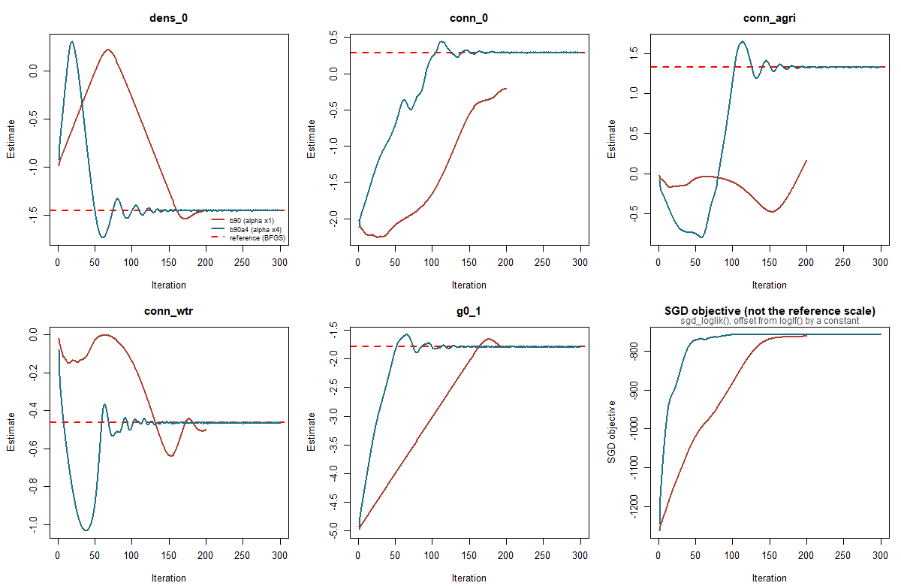
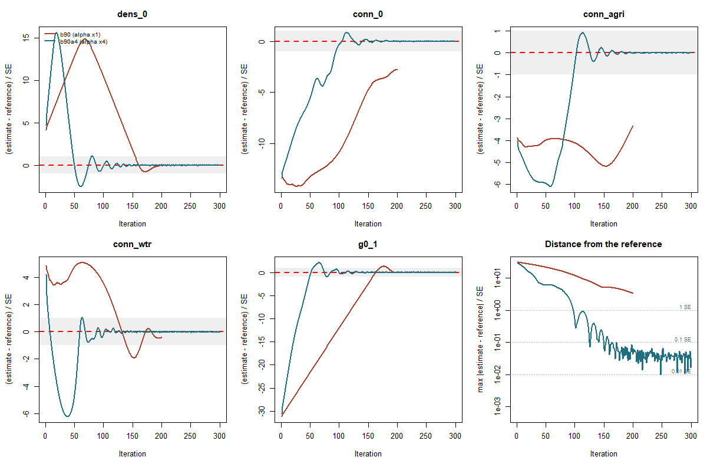
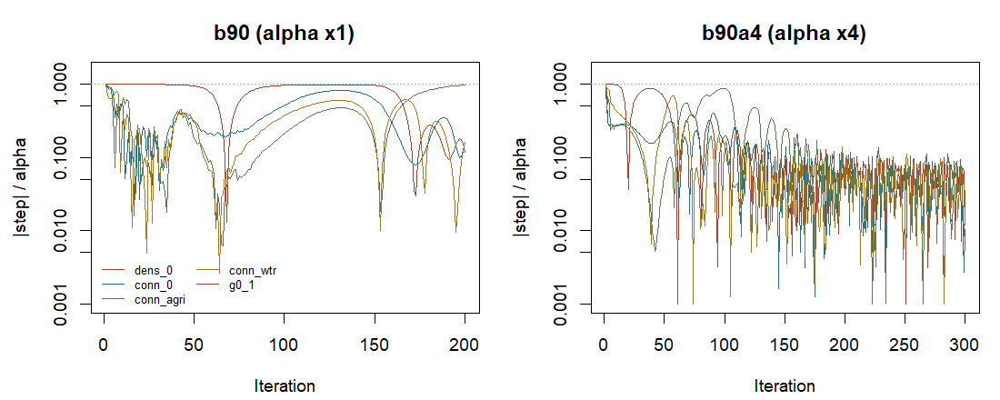

# クマ実データで `far` からの到達を検証した

**Step 3 の完了報告。** 答えを知らない遠方の初期値から、実データで参照解に到達した。

---

## 0. 結論

1. **到達した。** 最大 **0.032 標準誤差**。データが決められる精度の3%
2. **効いたのは `alpha` だけ。** 同じ `beta2 = 0.9` で、×1 は 3.33 SE、×4 は 0.032 SE
3. **実用上の到達は126反復目**（0.1 SE を切る）。**約33時間。**
   残り174反復は最適点のまわりの揺れで、止めてよかった
4. **検証台での切り分けが実データでそのまま当たった** —
   `beta2` が「着くかどうか」、`alpha` が「いつ着くか」
5. **判定に使った指標を1つ捨てた。** `trace_ll` と参照解の対数尤度は別の関数で、
   引き算に意味が無い（§5）

---

## 1. 実行

```
Rscript SGD_bear_20260909.R --init far --tag b90a4 --beta2 0.90 --alpha-mult 4 --max-iter 300
```

| | |
|---|---|
| データ | クマ実データ（Dryad）。`ncell` 8497 / 検出努力 227 |
| 検出個体 | **109（複数回 59 / 単回 50）** = 2.49 検出/個体 |
| 初期値 | `far`（−1, −2, 0, 0, −5）。**参照解の情報を含まない** |
| 設定 | `beta2` 0.9 / `alpha` ×4 / `sampling_rate` 1.0 |
| 反復 | 300 |
| 所要 | **78.0時間**（15.6分/反復） |

**`far` から出発することが要点。** 足環データには「変換して持ってくる既知の解」が無いので、
**遠方からの収束実証が本番の条件そのもの**になる。

---

## 2. 到達の判定

**係数の距離を標準誤差で割る。** データが決められる精度より細かく最適化しても意味がないので、
標準誤差が唯一の実務的な物差しになる。標準誤差は参照解のヘッセ行列から
（`SGD_bear_20260909_optim.rds`、2026-09-16 に取得）。

| | `dens_0` | `conn_0` | `conn_agri` | `conn_wtr` | `g0_1` |
|---|---|---|---|---|---|
| 最終値 | −1.4471 | 0.2894 | 1.3318 | −0.4655 | −1.7879 |
| 参照解 | −1.4505 | 0.2889 | 1.3322 | −0.4640 | −1.7912 |
| 差 | 0.0034 | 0.0005 | −0.0004 | −0.0015 | 0.0033 |
| 標準誤差 | 0.1126 | 0.1794 | 0.3505 | 0.0913 | 0.1024 |
| **差 / SE** | 0.030 | 0.003 | 0.001 | 0.016 | **0.032** |

**最大 0.032 SE。** 判定の目安（< 0.01 到達 / < 0.1 ほぼ到達 / < 1 標準誤差の範囲内）で
**「ほぼ到達」**にあたる。

### いつ到達したか

| 閾値 | 反復 | 実時間 |
|---|---|---|
| 1 SE を切る | 98 | 25時間 |
| **0.1 SE を切る** | **126** | **33時間** |
| 0.05 SE を切る | 160 | 42時間 |

**126反復で実用上は終わっていた。** 300反復まで回したのは予算を決め打ちしたからで、
**次からは診断を見て止めるべき**（§6）。

---

## 3. `alpha` だけが効いた





**2枚は役割が違う。** 図1は**係数が実際にどの値を取ったか**で、解釈に使うのはこちら。
図2は**到達したかどうかの判定**で、係数ごとにスケールが違う以上、生の値のままでは
「近い」かを判断できない（`conn_agri` の 0.01 と `g0_1` の 0.01 は標準誤差が 0.351 対 0.102）。

**図1では `dens_0` と `conn_wtr` はどちらの実行も参照解に重なって見える**が、
**図2の右下を見れば `alpha` ×1 が 3.33 SE 離れたまま終わったことが分かる。**
判定に図1を使うと見誤る。

| 実行 | `beta2` | `alpha` | 反復 | 最大 差/SE | 状態 |
|---|---|---|---|---|---|
| A2 / B4（週末 09-10〜13） | 0.999 | ×2 / ×4 | 200 | **5.4** | 失速 |
| `b90`（09-21〜23） | **0.9** | ×1 | 200 | **3.33** | 前進中（未完） |
| **`b90a4`（09-24〜27）** | **0.9** | **×4** | 300 | **0.032** | **到達** |

**`beta2` を直しただけでは届かず（3.33 SE）、`alpha` を4倍にして届いた（0.032 SE）。**
検証台Bで測った「`beta2` が着くかどうか、`alpha` がいつ着くか」が、
**実データで2つの実行として再現した。**

### 図から読めること

- **`alpha` ×4 は序盤に大きく行き過ぎる。** `dens_0` は +15 SE、`conn_wtr` は −6 SE まで振れてから戻る。
  **それでも発散しない** — Adam の歩幅は勾配の大きさに依らないため（検証台で ×8 まで確認済み）
- **`g0_1` の挙動が両者で対照的。** ×1（赤）は −5.0 から**ほぼ直線で**這い上がり180反復で参照解に届く。
  ×4（青）は60反復で届いて以降は揺れているだけ。**直線＝歩幅が上限に張り付いている＝遅い**
- **図2右下の距離パネルが判定そのもの。** 青は単調に下がって 0.03 付近で下げ止まる。
  **下げ止まりは失敗ではなく、`alpha` が決める着地の輪の大きさ**
- **図1右下の目的関数は、両者とも頭打ちに見える。** 赤も −850 付近まで上がっており、
  **これだけ見ると届いたように見えてしまう。** 係数を見なければ判断できない

---

## 4. 歩幅の読み方 — 失速と到達の区別



**`|step|/alpha` が小さいこと自体は失敗を意味しない。** 3つの状態を区別する必要がある。

| 歩幅 | 係数の距離 | 読み方 | 該当 |
|---|---|---|---|
| 小さい | **遠い** | **失速。反復を足しても無駄** | A2 / B4（`beta2` 0.999） |
| **大きい** | 遠い | **未完。反復を足せば進む** | `b90`（×1） |
| 小さい | **近い** | **到達。揺れているだけ** | `b90a4`（×4） |

**左右の図の形がまったく違う。** `b90`（左）は最後まで 0.3〜1.0 を保ったまま終わっており、
**全速で歩いていたのに間に合わなかった**。`b90a4`（右）は到達後に 0.1 以下へ落ち、
**激しく振動する** — 最適点では勾配の符号が振れるので `m` が打ち消し合い、`m/√v` が小さくなる。

---

## 5. 検証の限界と、捨てた指標

### 5.1 `trace_ll` は使っていない

**`trace_ll` に入っているのは SGD の目的関数 `sgd_loglik()`**（ポアソン項＋履歴項）で、
**参照解の `secrad_obj$loglf()` とは別の関数**。定数ぶんずれるので、
`sampling_rate = 1.0` でも一致しない。

**この2つを引き算していたために、係数が小数3桁まで一致しているこの実行に対して
「72.6 遅れている、埋めるのに693万反復」という数字が出た。**
`examples/diagnose_far_runs.R` からこの比較を削除し、距離/SE に置き換えた。

**`SGD_bear_20260909.R` は最終点で全データの対数尤度を1回測るようにした**（`ll_full_final`）。
`loglf` 1回（約3分）で、参照解と同じ物差しの値が手に入る。
**この実行はその修正より前なので、対数尤度での確認はできていない。**
係数が 0.032 SE 以内にある以上、**対数尤度の差は 0.001 未満のはず**だが、測ってはいない。

### 5.2 参照解が最大点である保証はまだ無い

判定はすべて「参照解と一致するか」で行っている。**参照解が最大点でなければ的が違う。**

09-17 に合成データ（疎な再捕獲）で**参照解が最大点でない例**を見つけている。
**クマでの検証（`--multistart`）は未実行**（09-21 に2本同時起動して落ちた）。

ただし 09-24 の研究は、**クマの密度（2.49検出/個体）では失敗しない**と予測している
（失敗は 1.13検出/個体 以下でのみ観測）。**予測であって検証ではない。**

### 5.3 1データセット・1回の実行

**これは「この設定がこのデータで届いた」という1例。** 確率的な保証ではない。
`sampling_rate = 1.0` なので乱数は勾配に入らず、同じ初期値なら再現するはずだが、
**別のデータで同じ設定が届く保証は無い。**

### 5.4 `alpha` ×4 の代償

着地が 0.032 SE で下げ止まる。**×1 なら（届きさえすれば）もっと細かく着く**はずで、
検証台Bでは ×1 が 0.0021、×8 が 0.0187 だった。
**データが決められる精度の3%なので実務上は無関係**だが、無料ではない。

---

## 6. 次にやること

1. **反復数を決め打ちしない。** 126反復で実用上終わっていたのに300まで回した。
   **診断（距離/SE と歩幅）を見て止める**運用にする。チェックポイントがあるので
   短く回して延長するほうが安全
2. **クマの多点出発**（`--multistart 4 --ms-max-hours 55 --ms-maxit 60`）。
   §5.2 の穴を埋める。**1本ずつ流すこと**
3. **Step 4（足環データ）。** 規模の確認が先。
   **1個体あたり検出数が 1.3 を超えるかどうか**が、多点出発の要否を決める

---

## 付録: 使ったファイル

| | |
|---|---|
| `results/SGD_bear_20260909_far_b90a4_result.RData` | この実行の結果（追跡対象） |
| `SGD_bear_20260909_far_b90_result.RData` | `alpha` ×1 の実行（比較対象） |
| `examples/plot_bear_runs.R` | この3枚の図を出す（生の係数 / 標準誤差の単位 / 歩幅） |
| `examples/diagnose_far_runs.R` | 数値の診断。距離/SE の判定を出す |
| `examples/inspect_result.R` | 結果ファイルの要約 |
| `reports/20260916_bracket_report.md` | 検証台での設定の窓。この実行の設計根拠 |
| `reports/20260924_multistart_report.md` | 多峰性の頻度。§5.2 の予測の出どころ |
