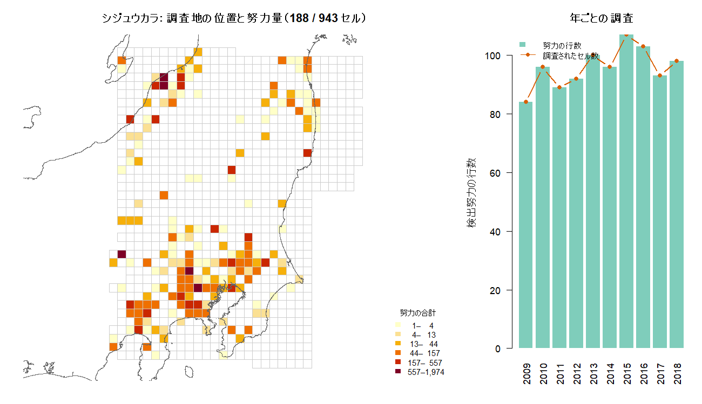
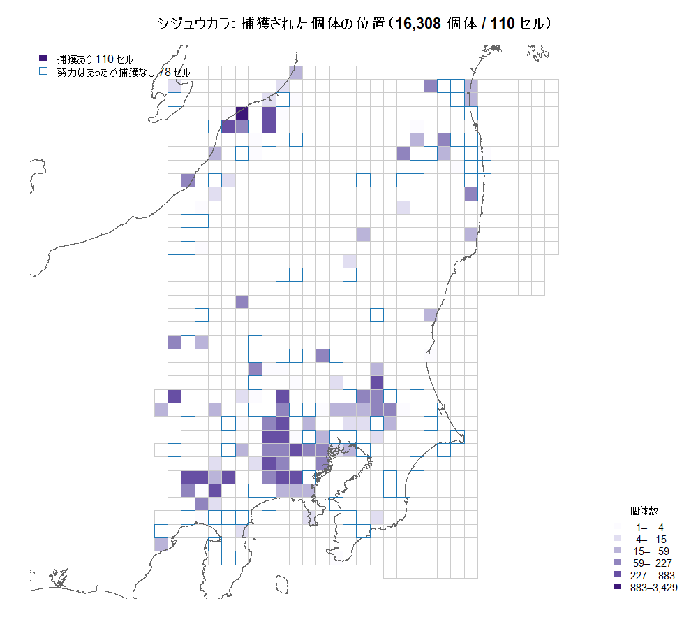
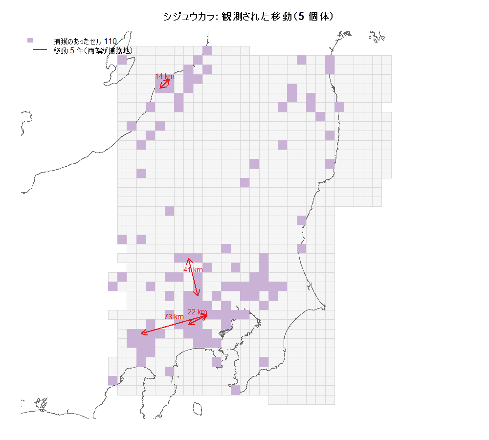

# シジュウカラ・関東データセットの内容

全国スケールのシジュウカラは計算が成立しない（`docs/20260929_作業記録.md`）。
**関東に切り出した場合に、実際にどんなデータセットになるのかを数えて示す。**

再現:

```
Rscript examples/band_subset.R                # 数値
Rscript examples/plot_band_kanto.R            # 図とセル別の表
```

出力: `results/band_subset.csv`（1行の要約）、`results/band_kanto_cells.csv`（943セル）。

---

## 1. 結論を先に

| | 値 |
|---|---|
| メッシュのセル数 | **943**（10km × 10km、各 100.0 km²） |
| 検出努力の行数 | **958**（メッシュ × 年） |
| 調査されたセル | **188**（943 の 19.9%） |
| 機会（年） | **10**（2009〜2018） |
| 個体数 | **16,308**（複数回 3,048 / 単回 13,260） |
| 検出の総数 | **21,118** |
| 1個体あたり検出 | **1.295** |
| 捕獲があったセル | **110** |
| **移動が観測された個体** | **5**（距離 14.1〜72.8 km） |
| **移動が観測されたセルの組** | **4**（5個体のうち2個体は同じ組） |

**計算は成立する。推定が成立するかは別問題。** §6 と §7 に分けて書く。

---

## 2. 解析範囲の位置


**`mesh2_convex_kanto.gpkg` は 1,013 セルあるが、そのうち 169 セル（17%）は
`mesh2_convex7.gpkg` に存在しない。** 別の世代・別の作り方で作られている。

`effort$meshcode` は `convex7` の行番号なので、**関東の gpkg をそのまま使うと
努力との対応が取れない**。そこで JIS 2次メッシュコードで突き合わせ、
**両方に存在する 943 セル**を解析範囲とした（§8 に突合の根拠）。

### 範囲の性質

共変量を割合に直すと（1セル = 100 km² = 1×10⁸ m²）:

| | 平均 | 最大 |
|---|---|---|
| 農地（`cultivated`） | 0.186 | 0.880 |
| 水域（`openwater`） | 0.236 | 1.000 |

**水域が半分を超えるセルが 213 / 943（22.6%）あり、実質的に海。**
ただし**そこに検出努力があるのは3セルだけ**なので、
密度推定への影響は限定的（海のセルは「捕獲努力ゼロ」として扱われる）。

全国メッシュでは海だけのセルが64%だったので、**関東への切り出しは
海の比率も下げている**（22.6%）。

---

## 3. 調査地はどこか



- **調査は関東平野南部（東京〜埼玉〜神奈川）と、新潟・長野の山地に集中**している
- **10年間の調査量はほぼ一定**（年あたり 84〜107 行、調査セル 84〜107）。
  年による大きな偏りは無く、**10機会が均等に使える**
- 努力量は 1 から 1,974 まで3桁の幅がある。
  ADCR では `log(effort)` がオフセットとして捕獲率に入るので、この幅は問題にならない

---

## 4. 個体はどこで捕まっているか



- **捕獲があったのは 110 セル。** 努力のあった 188 セルのうち **78 セルは捕獲ゼロ**
- 最大のセルで 3,429 個体。**上位数セルに個体が強く集中**している
- 捕獲ゼロのセルが 4割あるのは、**密度推定にとってはむしろ情報**
  （そこに個体がいない／捕まりにくいことを示す）

---

## 5. 移動はどこで観測されたか — **ここが最大の問題**



**5件しかない。しかもセルの組としては4つ。**

| 個体 | セル（JIS） | 距離 |
|---|---|---|
| #19380 | 533815 ←→ 533933 | 72.8 km |
| #27440 | 533815 ←→ 533933 | 72.8 km |
| #8103 | 533953 ←→ 543922 | 41.2 km |
| #4335 | 533922 ←→ 533933 | 22.4 km |
| #26981 | 563857 ←→ 563867 | 14.1 km |

- **#19380 と #27440 は同じセルの組**（533815 ←→ 533933）。
  **独立な「つながり」としては4本**
- 4本のうち3本は関東平野南部、1本は新潟の山地
- **境界をまたぐ個体は1個体だけ**なので、範囲を切ったことで失われた移動はほぼ無い
  （全国17件 → 関東5件になったのは、残り12件が関東の外で起きていたため）

---

## 6. 計算は成立する

`results/pcap_bench.csv` からの外挿（実測ではない）:

| | `loglf` 1回 | SGD 300反復 |
|---|---|---|
| 全国（13,454 × 33,551 × 4,229） | 14.8 日 | 23,052 日 |
| **関東（943 × 16,308 × 958）** | 1.6 時間 | 101 日 |
| **関東 ＋ `pcap` 修正済み** | **8.8 分** | **9.6 日** |

**`pcap` の `minCoeff` 巻き上げは 2026-09-29 に導入済み**（`adcrsgd/secrad.r`、
検証は `tests/pcap_fix_check.R` で最大絶対差 0）。したがって**現状の実力は
`loglf` 1回 約9分 / SGD 300反復 約10日**。

多峰性のため3点以上の多点出発が要るので（`reports/20260924_multistart_report.md`）、
**実務上は約30日**。クマの `far` 実証が78時間だったことを思えば重いが、
**手の届く範囲に入った**。

- 範囲を狭めたことで `ncell` 13,454→943、`neffort` 4,229→958、
  `nind` 33,551→16,308 と**3つ同時に減り、積で約130倍軽くなった**
- 間引き（`--rate`）は使わなくてよい。使っても `nind` は
  複数回捕獲の 3,048 を下回れない

---

## 7. 推定が成立するかは別問題

**ADCR が推定する透過性は `conn_0` / `conn_agri` / `conn_wtr` の3係数。
その情報源は「別のセルで再捕獲された個体」だけ。**

**係数3つに対して、独立な観測が4本。**

補助的な材料:

- **1個体あたり検出 1.295。** 多峰性の頻度を測った実験では
  1.11 が危険域（7.8%で最良の峰を逃す）、**1.29 で 0/77**
  （`reports/20260924_multistart_report.md`）。**境界のすぐ上**
- 複数回捕獲は 3,048 個体あるが、**そのほぼ全てが同じセル内の再捕獲**。
  「再捕獲が多い」ことと「移動が見える」ことは別
- 全国でも 17 件しかない。**範囲を広げても解決しない**

### 3,020 km 異常について（解決済み）

以前 `results/band_scale_check.csv` で全30種の `move_km_max` が
揃って 3,020.3 km になっていたのは、**検出行列に1列ずつ入っている
「全要素が 0 のダミー個体」**を捕獲地点として数えていたため。
`examples/band_moves.R` で特定し、修正済み（`docs/20260929_作業記録.md`）。

**その結果、シジュウカラの全国の移動は 18 件から 17 件に減った。**
関東の5件は元から正しい。**状況は良くなっていない。**

---

## 8. 突合の根拠（後で辿れるように）

**`effort$meshcode` は JIS メッシュコードではない。
`mesh2_convex7.gpkg` の「行番号」。**

```r
# make_data&plot.R:99-100
mesh <- st_read("../../griddata/mesh2_convex7.gpkg") %>% mutate(meshcode2 = row_number())
```

したがって:

| | |
|---|---|
| **世代を間違えると別の場所を指す** | `convex5` / `convex6` / `convex7` は行数まで同じ（13,454）なので、取り違えても範囲の照合では気づけない |
| **部分メッシュの行番号とは対応しない** | 関東の gpkg は独自に 1..1,013 で番号が振られている |

そこで `examples/band_subset.R` / `examples/plot_band_kanto.R` は、
**行番号ではなく JIS メッシュコード列（`meshcode`）**で突き合わせている。
両方の gpkg が持っているので厳密に対応が取れる。

### 検出行列の扱い

- **行 = 検出努力 / 列 = 個体**（`secrad.r` の `self$nind = ncol(detect)`）
- **値 0 の格納要素を必ず落とす**。疎行列は「格納されている要素」と
  「値が 0 でない要素」が一致しない

### 実際に走らせる場合に足りないもの

| | |
|---|---|
| **データの作り直し** | `effort$meshcode` は `convex7` の行番号なので、943セルで解析するには **1..943 に振り直したデータセットを作る**必要がある。`examples/plot_band_kanto.R` が `cell_new` としてその対応を持っている（`results/band_kanto_cells.csv` の `cell_sub` / `cell_all` 列） |
| **`make_data&plot.R` の不具合2件** | `:234`/`:237` の `grid_cov_std` 上書き、`:201-206` の 2.9GB 距離行列。データを作り直すなら先に直すこと |
| **シジュウカラ用の SGD スクリプト** | `SGD_bear_20260909.R` を雛形にする。`--rate` は不要 |
| **`sampling_rate` の実データ検証** | クマで実行中（`--tag b90a4r10`、約75時間）。結果を待ってから |

---

## 9. 判断が要る点

1. **観測4本で透過性を推定することの是非。**
   合成データで `n_moved` を振って、係数が識別できる下限を測れる
   （`examples/sgd_sim_conditions.R` の検証台。実データ不要）
2. **範囲の取り方。** 関東メッシュは矩形で、海域と山地を含む。
   捕獲のあった110セルの周辺だけに絞る、という選択もありうる
   （`ncell` がさらに減り計算は軽くなるが、密度推定の対象範囲が変わる）
3. **種の再検討。** 移動の観測数で並べると、留鳥では
   ノジコ 29 / ウグイス 26 / シジュウカラ 17 / クロツグミ 13 の順
   （修正後の値、全国）。**渡り鳥を除くとシジュウカラは上位**だが、
   どれも2桁に届かない

---

*数値の出所: `results/band_subset.csv` / `results/band_kanto_cells.csv`。
図: `examples/plot_band_kanto.R`。
経緯: `docs/20260929_作業記録.md`。*
