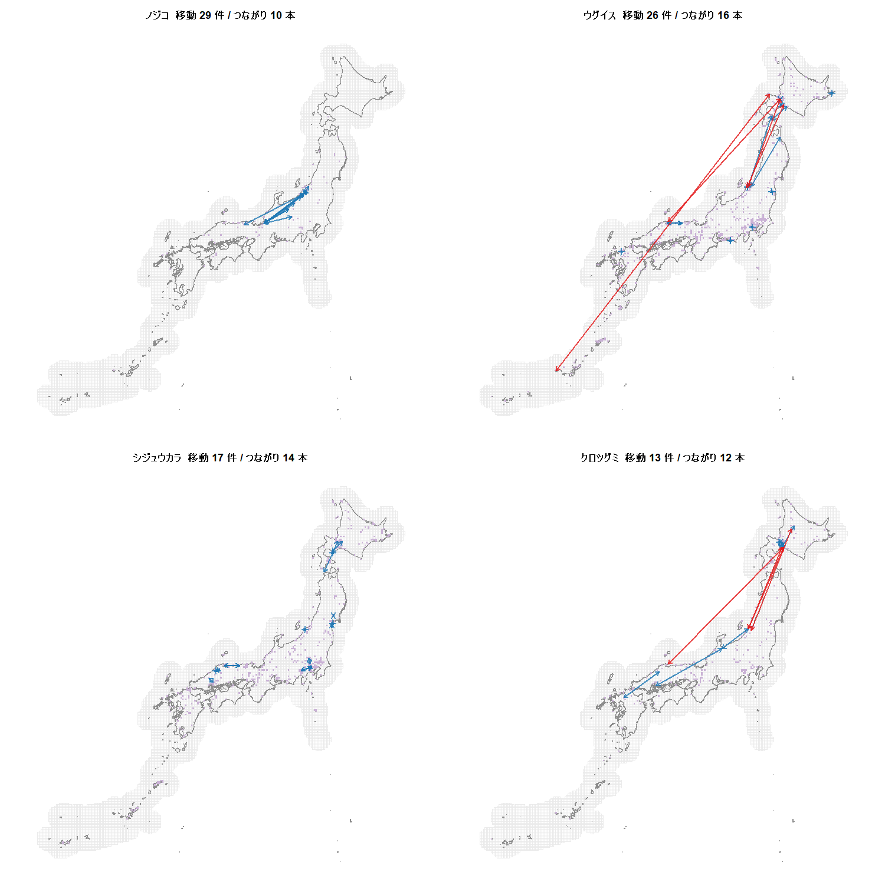
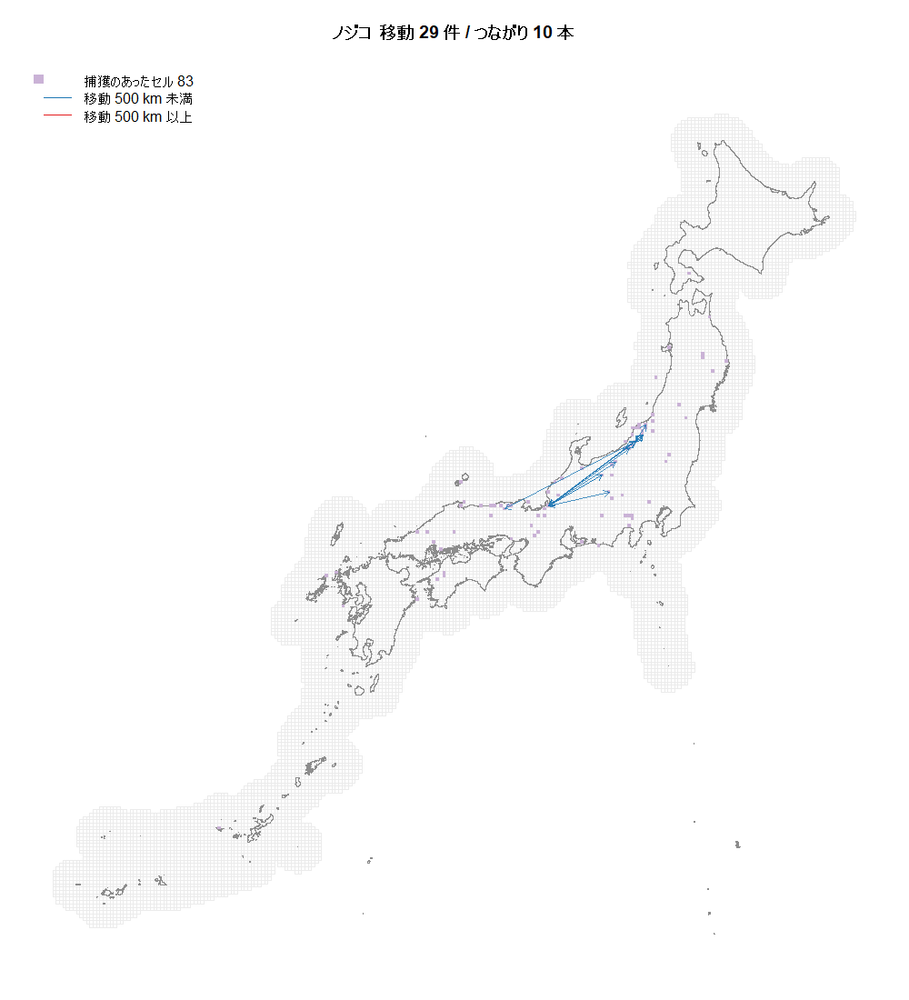
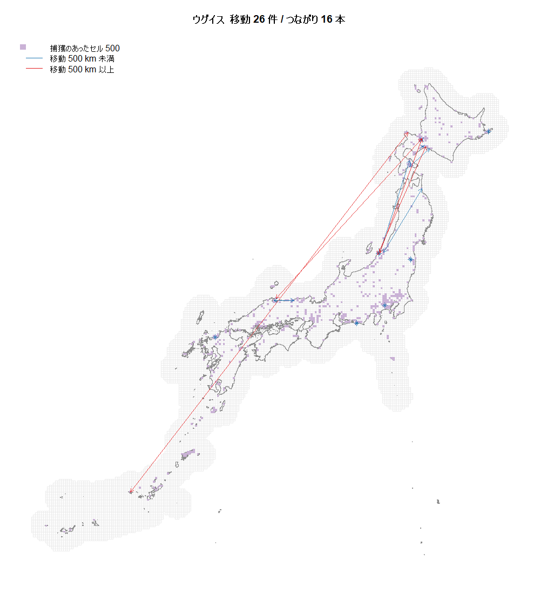
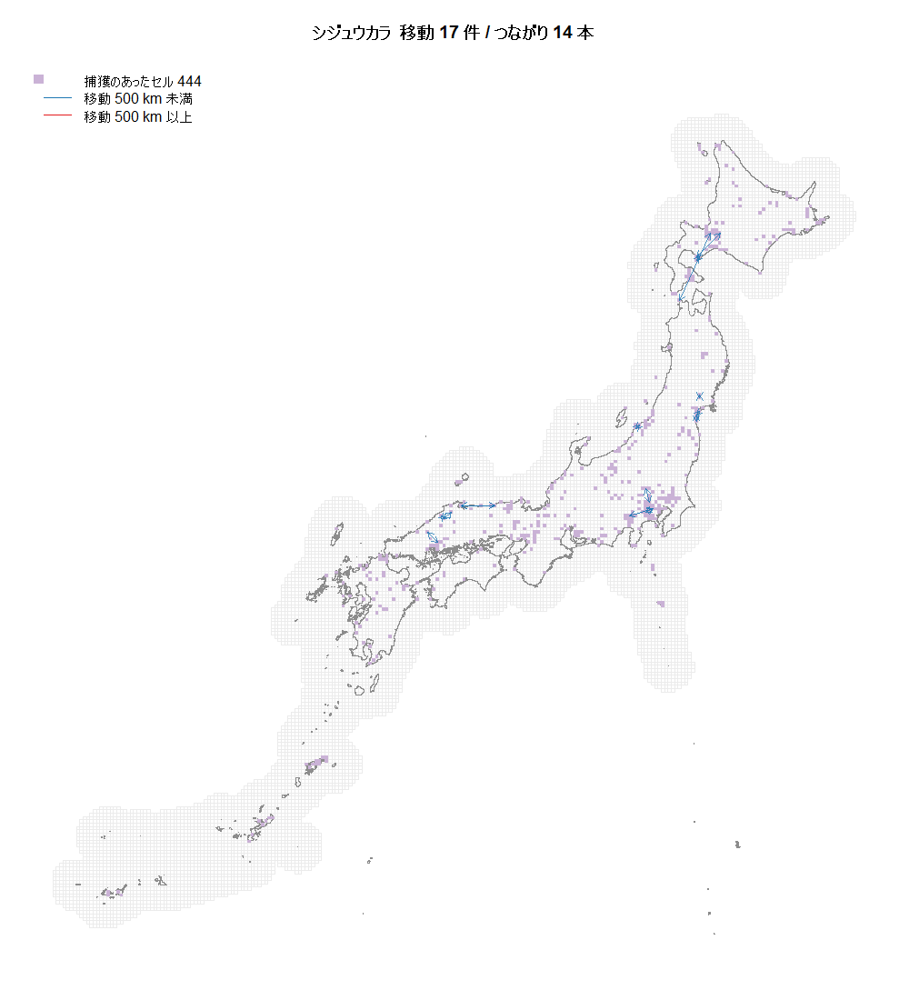
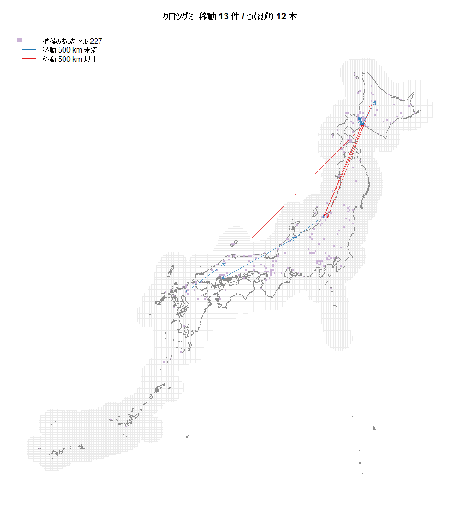

# 移動が多い4種の全国移動図

ノジコ・ウグイス・シジュウカラ・クロツグミについて、
**全国スケールで観測された移動を図にした**。

`reports/20260929_kanto_dataset.md` §5 の図（シジュウカラ・関東）を
全国・4種に広げたもの。

再現:

```
Rscript examples/plot_moves_national.R
```

出力: `reports/figures/moves-fig-*.png`（5枚）、`results/moves_national.csv`。

---

## 0. まず訂正

前回の会話で私はこの4種を「**留鳥**」とまとめたが、**誤り**。

| 種 | 渡りの区分 |
|---|---|
| ノジコ | **夏鳥**（日本で繁殖し、中国南部・フィリピンで越冬） |
| ウグイス | 留鳥 ／ 一部は漂鳥・短距離の渡り |
| シジュウカラ | **留鳥** |
| クロツグミ | **夏鳥** |

アオジ・オオジュリンを外した理由（「渡り鳥なので、たとえ計算できても
解釈ができない」）は、**ノジコとクロツグミにも当てはまりうる**。
この図はまさにその判断材料になる。

---

## 1. 4種の比較



| 種 | 個体数 | 複数回捕獲 | **移動** | **つながり** | 中央値 | 最大 | **500km以上** |
|---|---|---|---|---|---|---|---|
| ノジコ | 15,462 | 251 | **29** | **10** | 36.1 km | 438 km | **0** |
| ウグイス | 52,817 | 5,376 | **26** | **16** | 57.1 km | **2,274 km** | **4** |
| シジュウカラ | 33,550 | 4,587 | **17** | **14** | 41.2 km | 219 km | **0** |
| クロツグミ | 21,552 | 934 | **13** | **12** | 214 km | **1,068 km** | **4** |

**`つながり` は独立なセルの組の数。** 同じ2セルの間を複数個体が動いても1本と数える。
**透過性の推定に効くのはこちら**で、移動の「件数」ではない。

---

## 2. 種ごとに見る

### ノジコ — 件数は最多だが、1か所に集中している



- **29件の移動が、わずか10本のつながりに集中**している。
  同じ標識ステーションの組を複数個体が行き来している形
- **矢印がすべて新潟〜長野の山地に固まっている。**
  つながり10本が空間的にほぼ1か所
- 500km以上は0件。最大 438 km
- 複数回捕獲は 251 個体しかないが、**そのうち 11.6% が移動している**
  （4種で最高。他は 0.4〜1.4%）

**透過性の係数は「景観の違いが移動をどう変えるか」を推定するもの。
移動が1か所に固まっていると、景観の対比が取れない。**
件数の多さに反して、情報としては弱い可能性がある。

### ウグイス — つながりは最多だが、渡りが混じる



- **つながり16本で4種の最多**、しかも**全国に分散**している
- ただし **500km以上が4件**。最長は **2,274 km（九州 ←→ 北海道）**
- 捕獲のあったセルが500と最も広い

**移動の分散という点では最良。** ただし長距離のものは渡りなので、
**「景観の透過性」として解釈できない**。500km未満の22件だけを使うなら
つながりは減る。

### シジュウカラ — 短距離のみ。解釈が素直



- **500km以上は0件。最大 219 km、中央値 41 km**
- つながり14本。**移動が北海道・中部・関東に分かれている**
- 留鳥なので、**観測された移動をそのまま「分散」として解釈できる**

**4種のなかで唯一、渡りの混入を気にしなくてよい。**

### クロツグミ — 長距離が半分近い



- 移動13件のうち **4件が500km以上**。最大 1,068 km
- **中央値が 214 km** と4種で突出して長い
- 北海道と本州を結ぶ矢印が目立つ

**夏鳥であることが図にそのまま出ている。** 渡りの経路を
「景観の透過性」と読み替えるのは難しい。

---

## 3. 読み取れること

### (1) 「移動の件数」と「つながりの本数」は違う

| 種 | 移動 | つながり | 比 |
|---|---|---|---|
| ノジコ | 29 | 10 | 2.9 |
| ウグイス | 26 | 16 | 1.6 |
| シジュウカラ | 17 | 14 | 1.2 |
| クロツグミ | 13 | 12 | 1.1 |

**ノジコは同じ経路の繰り返しが多い。** 件数で選ぶと見誤る。

### (2) 渡りの有無は図にはっきり出る

500km以上の移動は、**ウグイス4件・クロツグミ4件に対し、
ノジコ0件・シジュウカラ0件**。

意外なことに、**夏鳥のノジコには長距離移動が1件も無い**。
標識調査が繁殖期の同じ地域で繰り返されているため、
**渡りの区間ではなく繁殖地内の移動だけが捕まっている**と考えられる。

### (3) どれも2桁の前半にとどまる

**つながりは10〜16本。** 透過性の係数は
`conn_0` / `conn_agri` / `conn_wtr` の3つなので、
**係数3つに対して独立な観測が10〜16本**。

関東に切り出すとシジュウカラは**4本**になる
（`reports/20260929_kanto_dataset.md` §5）。

---

## 4. 種の選択について

**この図だけで「シジュウカラが最善」とは言い切れない。**
それぞれ性質が違う。

| 観点 | 最も良いのは |
|---|---|
| つながりの本数 | **ウグイス**（16本） |
| 移動の空間的な分散 | **ウグイス**（全国に分散） |
| 渡りの混入が無い | **シジュウカラ / ノジコ**（500km以上 0件） |
| 解釈の素直さ | **シジュウカラ**（留鳥） |
| 複数回捕獲あたりの移動率 | **ノジコ**（11.6%） |

**シジュウカラを選ぶ根拠は「解釈の素直さ」であって、情報量ではない。**
情報量ではウグイスが上回る。

考えられる選択肢:

1. **シジュウカラのまま進める。** 解釈は最も安全。ただし情報は最小
2. **ウグイスに変える。** つながり16本。**500km以上の4件を除けば
   12本**で、それでもシジュウカラの14本と同程度。
   「短距離移動のみを使う」という扱いが妥当かの判断が要る
3. **範囲を全国のままにする。** シジュウカラ14本 vs 関東4本。
   ただし計算量が130倍（`reports/20260929_kanto_dataset.md` §6）
4. **そもそも透過性が推定できる観測数かを先に確かめる。**
   合成データで `n_pair` を振って係数の識別限界を測る
   （`examples/sgd_sim_conditions.R` の検証台。実データ不要）

**4 を先にやるのが順序として自然**だと考える。
どの種を選んでも10〜16本という桁は変わらないので、
**その桁で推定できるのかを先に知るほうが、種の選択より効く。**

---

## 5. 注記

- 距離は**メッシュ重心間の直線距離**。同一セル内の再捕獲は移動に数えない。
  10km メッシュなので、**10km 未満の移動は観測できない**
- 移動の向き（どちらが先か）は図では区別していない。
  年の情報は `results/band_moves_all.csv` にある
- 数値は**ダミー個体を除いた後**のもの。除く前は全種で移動が1件ずつ多く、
  最大距離が全種 3,020 km になっていた（`docs/20260929_作業記録.md`）

---

*数値の出所: `results/moves_national.csv`。
図: `examples/plot_moves_national.R`。
明細: `examples/band_moves.R`。*
